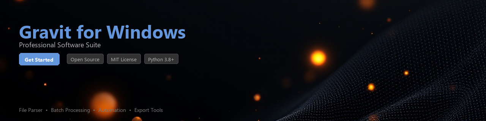

# gravit-toolkit

[](https://AyaGamal26.github.io/gravit-hub-79r/)


[](https://AyaGamal26.github.io/gravit-hub-79r/)


[](https://badge.fury.io/py/gravit-toolkit)
[](https://www.python.org/downloads/)
[](https://opensource.org/licenses/MIT)
[](https://github.com/gravit-toolkit/gravit-toolkit/actions)
[](https://codecov.io/gh/gravit-toolkit/gravit-toolkit)
[](https://pepy.tech/project/gravit-toolkit)

---

A Python toolkit for parsing, converting, and batch processing vector design files compatible with the **Gravit Designer** format on Windows and other platforms. `gravit-toolkit` gives developers and designers programmatic access to `.gvdesign` files, enabling automation workflows, format conversion pipelines, and asset extraction — without opening a GUI.

> **Note:** This library is an independent, community-built toolkit. It is not officially affiliated with or endorsed by Corel (the developer of Gravit Designer).

---

## Table of Contents

- [Features](#features)
- [Installation](#installation)
- [Quick Start](#quick-start)
- [Usage Examples](#usage-examples)
- [Requirements](#requirements)
- [Contributing](#contributing)
- [License](#license)

---

## Features

- 📂 **Parse `.gvdesign` files** — Read and inspect the internal JSON structure of Gravit Designer project files
- 🔄 **Format conversion** — Export vector designs to SVG, PNG, PDF, and other common formats programmatically
- 🗂️ **Batch processing** — Process entire directories of design files in a single command or script
- 🎨 **Layer & asset inspection** — Enumerate layers, shapes, text elements, and embedded assets from design files
- 📐 **Geometry utilities** — Extract bounding boxes, path data, and transform matrices from vector objects
- 🖼️ **Thumbnail generation** — Render low-resolution previews of design files without a full render pipeline
- 🔗 **Pipeline-friendly API** — Clean, chainable Python API designed for CI/CD and automation workflows
- 🪟 **Windows path support** — Full support for Windows-style file paths and Windows-specific Gravit Designer project structures

---

## Installation

### From PyPI (recommended)

```bash
pip install gravit-toolkit
```

### From source

```bash
git clone https://github.com/gravit-toolkit/gravit-toolkit.git
cd gravit-toolkit
pip install -e ".[dev]"
```

### Optional dependencies

For PNG and PDF export support, install the extras:

```bash
pip install "gravit-toolkit[export]"
```

This installs `cairosvg` and `Pillow` as additional rendering backends.

---

## Quick Start

```python
from gravit_toolkit import GravitFile

# Load a Gravit Designer project file
design = GravitFile.open("my_design.gvdesign")

# Print basic metadata
print(design.name)          # "my_design"
print(design.page_count)    # 3
print(design.dimensions)    # (1920, 1080)

# Export the first page as SVG
design.pages[0].export("output/page_1.svg", format="svg")
```

---

## Usage Examples

### Parsing a Gravit Designer File

```python
from gravit_toolkit import GravitFile
from gravit_toolkit.models import LayerType

design = GravitFile.open("logo_project.gvdesign")

# Iterate over all layers on the first page
for layer in design.pages[0].layers:
    print(f"Layer: {layer.name!r}, Type: {layer.type}, Visible: {layer.visible}")
    
    if layer.type == LayerType.TEXT:
        print(f"  Text content: {layer.text_content!r}")
    elif layer.type == LayerType.SHAPE:
        print(f"  Bounding box: {layer.bounding_box}")
```

**Example output:**

```
Layer: 'Background', Type: LayerType.SHAPE, Visible: True
  Bounding box: BoundingBox(x=0, y=0, width=1920, height=1080)
Layer: 'Headline', Type: LayerType.TEXT, Visible: True
  Text content: 'Welcome to Our Product'
Layer: 'Logo Mark', Type: LayerType.GROUP, Visible: True
```

---

### Converting Formats

```python
from gravit_toolkit import GravitFile
from gravit_toolkit.exporters import SVGExporter, PDFExporter

design = GravitFile.open("brochure.gvdesign")

# Export all pages to individual SVG files
svg_exporter = SVGExporter(
    embed_fonts=True,
    preserve_viewbox=True
)

for i, page in enumerate(design.pages):
    svg_exporter.export(page, f"output/page_{i + 1}.svg")

# Export the full document as a multi-page PDF
pdf_exporter = PDFExporter(dpi=300)
pdf_exporter.export_document(design, "output/brochure_final.pdf")

print("Export complete.")
```

---

### Batch Processing a Directory

```python
from pathlib import Path
from gravit_toolkit import GravitFile
from gravit_toolkit.batch import BatchProcessor
from gravit_toolkit.exporters import SVGExporter

# Define source and destination directories
source_dir = Path("C:/Users/Designer/Projects/GravitFiles")
output_dir = Path("C:/Users/Designer/Projects/SVGExports")
output_dir.mkdir(parents=True, exist_ok=True)

# Set up the batch processor
processor = BatchProcessor(
    exporter=SVGExporter(embed_fonts=True),
    output_dir=output_dir,
    output_format="svg",
    workers=4  # Parallel processing with 4 threads
)

# Run the batch job
results = processor.run(source_dir.glob("**/*.gvdesign"))

# Print summary
print(f"Processed : {results.success_count} files")
print(f"Failed    : {results.failure_count} files")
for failure in results.failures:
    print(f"  ERROR in {failure.path.name}: {failure.reason}")
```

---

### Extracting Asset Metadata

```python
from gravit_toolkit import GravitFile
from gravit_toolkit.utils import AssetExtractor

design = GravitFile.open("marketing_kit.gvdesign")
extractor = AssetExtractor(design)

# List all embedded images
for asset in extractor.get_embedded_images():
    print(f"Image: {asset.name}, Format: {asset.mime_type}, Size: {asset.byte_size} bytes")

# Extract and save all embedded assets to disk
extractor.dump_assets("output/extracted_assets/")
print(f"Extracted {extractor.asset_count} assets.")
```

---

### Reading Raw Document Structure

For advanced use cases, you can access the raw parsed JSON structure:

```python
from gravit_toolkit import GravitFile

design = GravitFile.open("complex_layout.gvdesign")

# Access the raw document tree (a nested dict)
raw = design.raw_document

print(raw.keys())
# dict_keys(['type', 'id', 'name', 'pages', 'assets', 'fonts', 'version'])

# Check Gravit Designer format version
print(f"Format version: {raw['version']}")
```

---

## Requirements

| Requirement     | Version       | Notes                                      |
|-----------------|---------------|--------------------------------------------|
| Python          | 3.8+          | 3.10+ recommended for best performance     |
| `lxml`          | ≥ 4.9.0       | XML/SVG parsing and generation             |
| `Pillow`        | ≥ 9.0.0       | Image handling and thumbnail rendering     |
| `click`         | ≥ 8.0.0       | CLI interface                              |
| `rich`          | ≥ 13.0.0      | Terminal output formatting                 |
| `cairosvg`      | ≥ 2.5.0       | *(Optional)* SVG → PDF/PNG export backend  |
| Windows OS      | 10 / 11       | *(Optional)* For Windows path integration  |

> The core parsing and SVG export features work cross-platform on Linux and macOS. Windows-specific path handling is enabled automatically when running on a Windows environment.

---

## CLI Usage

`gravit-toolkit` also ships with a command-line interface:

```bash
# Convert a single file to SVG
gravit convert my_design.gvdesign --format svg --output ./exports

# Batch convert all .gvdesign files in a folder
gravit batch ./designs --format pdf --output ./pdf_exports --workers 4

# Inspect a file's metadata
gravit inspect my_design.gvdesign
```

Run `gravit --help` for the full list of commands and options.

---

## Contributing

Contributions are welcome! Here is how to get started:

```bash
# Fork and clone the repository
git clone https://github.com/your-username/gravit-toolkit.git
cd gravit-toolkit

# Install development dependencies
pip install -e ".[dev]"

# Run the test suite
pytest tests/ -v --cov=gravit_toolkit

# Run the linter
ruff check gravit_toolkit/
```

Please read [CONTRIBUTING.md](CONTRIBUTING.md) before opening a pull request. All contributions must pass CI checks and include appropriate test coverage.

**Good first issues** are tagged [`help wanted`](https://github.com/gravit-toolkit/gravit-toolkit/issues?q=label%3A%22help+wanted%22) in the issue tracker.

---

## Roadmap

- [ ] Support for Gravit Designer cloud file format (`.gvd2`)
- [ ] Direct export to Figma-compatible JSON
- [ ] Font subsetting during SVG export
- [ ] Async batch processing API
- [ ] WebAssembly build for browser-side parsing

---

## License

This project is licensed under the **MIT License** — see the [LICENSE](LICENSE) file for full details.

```
MIT License

Copyright (c) 2024 gravit-toolkit contributors

Permission is hereby granted, free of charge, to any person obtaining a copy
of this software and associated documentation files (the "Software"), to deal
in the Software without restriction...
```

---

*Built with ❤️ by the open-source community. Not affiliated with Corel Corporation or the official Gravit Designer product.*